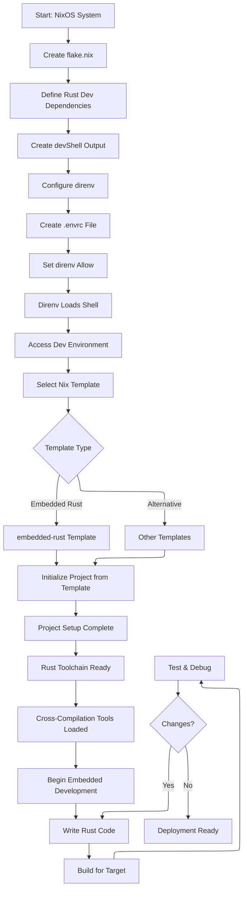
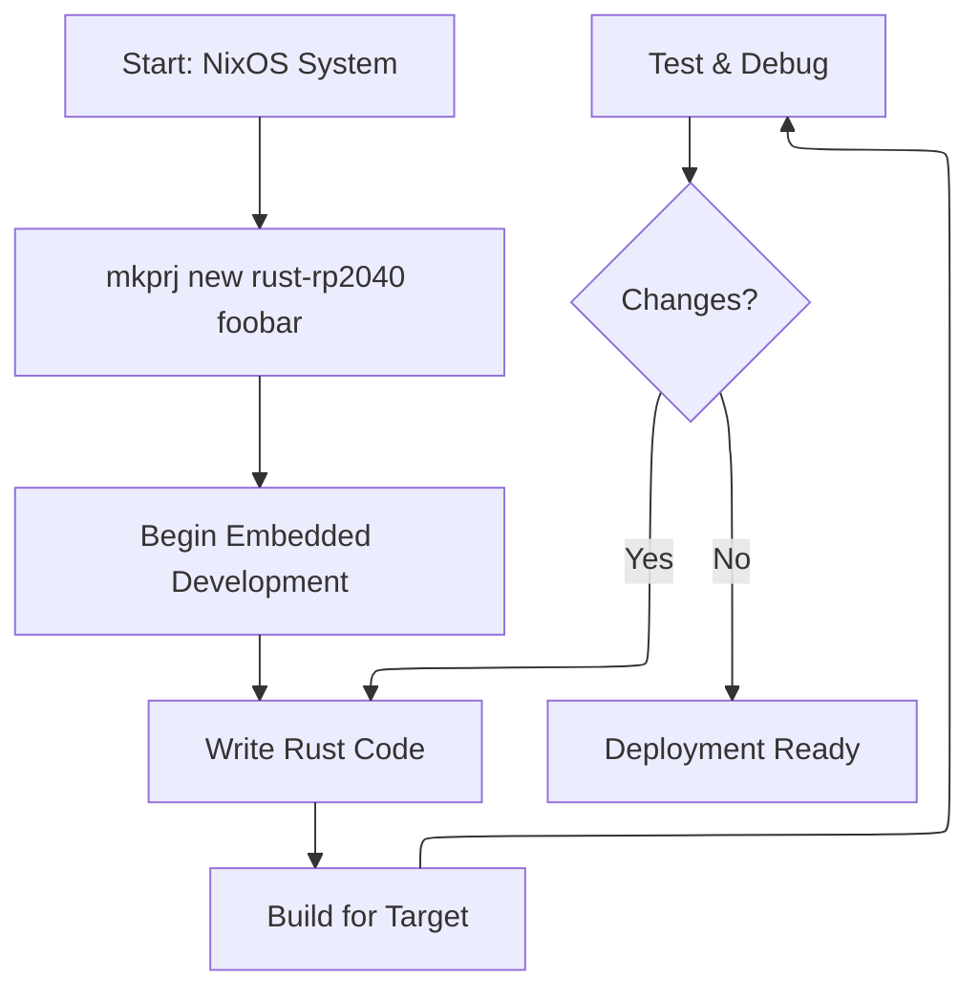

# toolkits

my `nix flake new -t git+https://codeberg.org/slaxor/templates#rust-rp2040 ~/proj/blinky-test` conveniences 

Your workflow (assumed):

```mermaid
---
config:
  layout: elk
---
flowchart TD
    A[Start: NixOS System] --> B[Create flake.nix]
    B --> C[Define Rust Dev Dependencies]
    C --> D[Create devShell Output]
    D --> E[Configure direnv]
    E --> F[Create .envrc File]
    F --> G[Set direnv Allow]
    G --> H[Direnv Loads Shell]
    H --> I[Access Dev Environment]
    I --> J[Select Nix Template]
    J --> K{Template Type}
    K -->|Embedded Rust| L[embedded-rust Template]
    K -->|Alternative| M[Other Templates]
    L --> N[Initialize Project from Template]
    M --> N
    N --> O[Project Setup Complete]
    O --> P[Rust Toolchain Ready]
    P --> Q[Cross-Compilation Tools Loaded]
    Q --> R[Begin Embedded Development]
    R --> S[Write Rust Code]
    S --> T[Build for Target]
    T --> U[Test & Debug]
    U --> V{Changes?}
    V -->|Yes| S
    V -->|No| W[Deployment Ready]
    
    classDef startEnd stroke #4ade80,fill #f0fdf4
    classDef flakeConfig stroke #818cf8,fill #eef2ff
    classDef direnvConfig stroke #2dd4bf,fill #f0fdfa
    classDef template stroke #a78bfa,fill #f5f3ff
    classDef devWork stroke #fb923c,fill #fff7ed
    classDef workflow stroke #38bdf8,fill #f0f9ff
    
    class A,W startEnd
    class B,C,D flakeConfig
    class E,F,G,H direnvConfig
    class J,K,L,M,N template
    class O,P,Q devWork
    class R,S,T,U,V workflow
```

or use this and

```mermaid
---
config:
  layout: elk
---
flowchart TD
    A[Start: NixOS System] --> B[mkprj new rust-rp2040 foobar]
    B --> C[Begin Embedded Development]
    C --> D[Write Rust Code]
    D --> E[Build for Target]
    E --> F[Test & Debug]
    F --> G{Changes?}
    G -->|Yes| D
    G -->|No| H[Deployment Ready]
    
    classDef startEnd stroke #4ade80,fill #f0fdf4
    classDef flakeConfig stroke #818cf8,fill #eef2ff
    classDef direnvConfig stroke #2dd4bf,fill #f0fdfa
    classDef template stroke #a78bfa,fill #f5f3ff
    classDef devWork stroke #fb923c,fill #fff7ed
    classDef workflow stroke #38bdf8,fill #f0f9ff
    
    class A,G startEnd
    class C,D,E devWork
    class F,G,H workflow
```